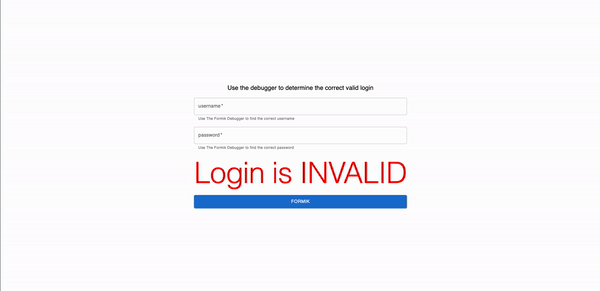

# formik-debugger

[](https://www.npmjs.com/package/formik-debugger)

## Table of Contents

- [**_Required Packages_**](#Required_Packages)
- [**_Library installation_**](#Library-installation)
- [**_Usage_**](#Usage)


## **_Required Packages_**

This package requires the following peer dependencies
- "formik": `"^2.2.9"` or higher
- "react": `"^17.0.1"` or higher
- "react-dom": `"^17.0.1"` or higher


## **_Library installation_**

```shell
npm install formik-debugger
```

```shell
yarn add formik-debugger
```

```shell
pnpm install formik-debugger
```

```shell
bun add formik-debugger
```

## **_Usage_**

Formik-Debugger supports both forms of Formik and supports both a Draggable Modal version and a fixed non-modal version. Multiple `<DebuggerModals/>` can be called at the same time without issue if desired to support multiple instances of Formik on your application at once.

Everything can be imported from `import {Debugger, DebuggerModal} from "formik-debugger"` 

### **_Debugger Modal_**

Formik Initialized through the `<Formik/> Component`
```tsx
function App() {
    const [isOpen, setIsOpen] = useState(false)

    return (
        <Formik 
            initialValues={formikInitialState} 
            //...
        >
            {props => (
                <>
                    <input name={"username"} onChange={props.handleChange} value={props.values.username}/>
                    <input name={"password"} onChange={props.handleChange} value={props.values.password}/>
                    <DebuggerModal open={isOpen} onClose={()=>setIsOpen(false)} formik={props}/>
                    <button onClick={()=>setIsOpen(prev=>!prev)}>Formik</button>
                </>
            )}
        </Formik>
    )
}
```

Formik Initialized through the `useFormik` hook

```tsx
function App() {
    const [isOpen, setIsOpen] = useState(false)

    const formik = useFormik({
        initialValues: formikInitialState,
        validationSchema: formikSchema,
    } as FormikConfig<typeof formikInitialState>)
    
    return (
        <>
            <input name={"username"} onChange={formik.handleChange} value={props.values.username}/>
            <input name={"password"} onChange={formik.handleChange} value={formik.values.password}/>
            <DebuggerModal open={isOpen} onClose={()=>setIsOpen(false)} formik={formik}/>
            <button onClick={()=>setIsOpen(prev=>!prev)}>Formik</button>
        </>
           
    )
}
```

### **_Debugger_**
A simplier version that remains static on the page (also compatible with either version of Formik)
```tsx
function App() {
    const formik = useFormik({
        initialValues: formikInitialState,
        validationSchema: formikSchema,
    } as FormikConfig<typeof formikInitialState>)

    return (
        <>
            <input name={"username"} onChange={formik.handleChange} value={props.values.username}/>
            <input name={"password"} onChange={formik.handleChange} value={formik.values.password}/>
            <Debugger formik={formik}/>
        </>

    )
}
```

### **_Custom Tools_**
If you wish to add additional tools to the debugger simple add your custom tool to an array and pass them into the props of either components as so
```tsx
function App() {
    const [isOpen, setIsOpen] = useState(false)

    const formik = useFormik({
        initialValues: formikInitialState,
        validationSchema: formikSchema,
    } as FormikConfig<typeof formikInitialState>)
    
    const customTools = [
        <CustomToolOne/>,
        <CustomToolTwo/>,
        <CustomToolThree/>,
    ]
    
    return (
        <>
            <input name={"username"} onChange={formik.handleChange} value={props.values.username}/>
            <input name={"password"} onChange={formik.handleChange} value={formik.values.password}/>
            <DebuggerModal open={isOpen} onClose={()=>setIsOpen(false)} formik={formik} customTools={customTools}/>
            <Debugger formik={formik} customTools={customTools}/>
            <button onClick={()=>setIsOpen(prev=>!prev)}>Formik</button>
        </>
           
    )
}
```

A new option for custom tools should appear in the tool labeled `CUSTOM TOOLS` Where you can see your custom tools!



